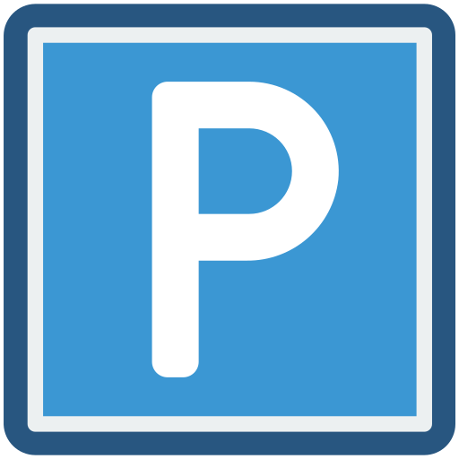

<div align="center">

</div>

# shared parking

 A responsive web application to manage your local parking space. Request a parking spot from others and provide your own parking spot for others to use!

## Description

I live in a large house with more than 200 appartments. Each appartment has an assigned parking space, but not all spaces are used all the time.
Therefore, we share the spaces, mostly for when visitors come over.
So far, we have used a WhatsApp Group chat to manage the requests and spaces, but that's confusing and impractical.  
For example: When requesting a space in advance, the request may not be answered because the time slot cannot be confirmed for sure, and then the request slips to the back.

To improve the situation, this application was created.
You can send requests, answer requests or simply provide your parking spot in case someone needs it. 

## Getting Started

### Dependencies

* Docker and docker-compose

Please make sure docker-compose is installed
```
docker-compose --version
```

If you haven't installed docker-compose, please refer to the [project documentation](https://docs.docker.com/compose/install/)

* The Docker images are based on:
    * nodejs
    * mongoDB

### Environment Variables
Currently no `.env` file is used. Instead, all variables are added directly to the code and Dockerfile.
These should currently be left alone, but may be moved to a `.env` file in the future.

### Installing

No installation required, we simply use [docker-compose](https://docs.docker.com/compose/install/) and the rest is handled for us.
Also traefik can be used to deploy the application.
Please check the traefik labels on the app before deploying your own application!

### Executing program

Simply start up the application:
```
docker-compose up -d build
```
Point your browser to your application [http://localhost:3000/](http://localhost:3000/)  
Make sure your port is the same as configured, 3000 per default.
If you use traefik, it's according to your entrypoint.

### Traefik
Currently, I use the following labels for traefik:
```
    labels:
      - traefik.enable=true
      - traefik.http.routers.parking.entrypoints=websecure
      - traefik.http.routers.parking.rule=Host(`parking.block-it.ovh`)
      - traefik.http.routers.parking.tls=true
      - traefik.http.routers.parking.tls.certresolver=lets-encrypt
      - traefik.docker.network=web
      - traefik.http.routers.parking.middlewares=chain-no-auth@file
```
We don't specify any ports etc. as traefik handles this for us.
Please note that the entrypoint, hostname, network and middlewares must be adjusted to your setup.
There are some great ressources online on how to do this, check e.g. [the quick-start guide](https://doc.traefik.io/traefik/getting-started/quick-start/).

## Help

Yeah there is no real help, you're pretty much on your own. Of course you can always add an [issue](https://github.com/thebootable/shared-parking/issues/new/choose).

## Roadmap

- [x] Implement basic idea
- [x] Add Layout and CSS
- [x] Add Darkmode
- [ ] Add backend API
    - [x] get-methods
        - [x] public: available spots
        - [x] public: open requests
        - [x] private: user-specific requests
        - [x] private: user-specific offers
        - [x] private: parking spot details
        - [x] private: user-specific spots
        - [x] public: parking spot details
        - [x] public: user details
        - [x] private: validate session
    - [x] post-methods
        - [x] registration
        - [x] login and logout
        - [x] sessions
        - [x] add/remove spot
        - [x] add/remove spot request
        - [x] add/remove spot offer
- [x] Add Frontend functionality
    - [x] get parking spots
    - [x] register my parking spot
    - [x] provide my parking spot
- [ ] Sanitize inputs: Prevent malicious content and add requirements (e.g. correct mail-adress)
- [ ] Finish auth: add session requirement to all private functions in API
    - [ ] make all functions private
    - [ ] move all functions to the same layout
- [ ] Add reservation functionality
    - [ ] create reservation
    - [ ] view my reservations
    - [ ] answer an open parking spot request
- [x] Add deployment: docker-compose and traefik
- [ ] Add User management
    - [x] Registration
    - [x] Login
- [ ] Add notifications
    - [ ] notifications via e-mail
    - [ ] browser push-notifications

See the [open issues](https://github.com/thebootable/shared-parking/issues) for a full list of proposed features (and known issues).

## Authors

* [@thebootable](https://github.com/thebootable)

## Version History

* 0.1
    * Initial Release

## License

This project is licensed under the GNU General Public License v3.0 License - see the LICENSE.md file for details

## Acknowledgments

Inspiration, code snippets, etc.
* [Font Awesome for the awesome icons](https://fontawesome.com/)
* [basic readme template](https://gist.github.com/DomPizzie/7a5ff55ffa9081f2de27c315f5018afc)
* [Project Parking icons created by Smashicons - Flaticon](https://www.flaticon.com/free-icons/parking)
